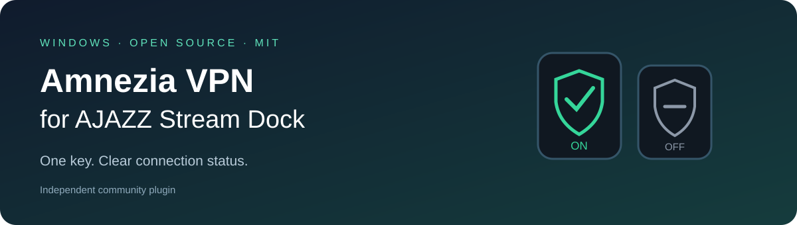

# Amnezia VPN for AJAZZ Stream Dock



**[Download](https://github.com/RucardTomsk/ajazz-amnezia-vpn/releases/latest)** · [Русский](../README.md) · [Changelog](../CHANGELOG.md) · [MIT license](../LICENSE)

A Windows plugin that displays AmneziaVPN connection state on an AJAZZ key and
toggles it through the client's own UI Automation button. Polling updates the
icon every two seconds. The plugin uses the server selected in Amnezia; it does
not read VPN keys or profiles. This is an independent community project.

## Install

1. Install and start AJAZZ once. Configure and start AmneziaVPN.
2. Download **AmneziaVPN-AJAZZ.zip** from Releases, not the Source code archive.
3. Extract it and run from that folder:

```powershell
powershell -NoProfile -ExecutionPolicy Bypass -File .\Install-AmneziaPlugin.ps1
```

4. Restart AJAZZ, then add **Amnezia VPN → VPN: вкл / выкл** to a key.
5. Select your protocol, save settings, and use **Проверить совместимость**
   (Check compatibility). Enable the checkbox to allow that key to toggle VPN.

Monitoring is the default. Installation, saving settings, and diagnostics never
toggle the connection. End users do not need a separate Node.js, npm, or Python.
The plugin settings panel is currently in Russian; client state labels support
Russian, English, and a configurable pair for other languages.

The installer uses `%APPDATA%\HotSpot\StreamDock\plugins`; pass
`-PluginsDirectory "D:\your\plugins"` for a different host location.
Alternatively, copy the `com.rucard.amnezia.sdPlugin` folder there manually.
To upgrade, rerun the installer; it saves a backup next to the extracted installer.
To uninstall, remove the key action, close AJAZZ, and delete only that plugin folder.

Compare `Get-FileHash .\AmneziaVPN-AJAZZ.zip -Algorithm SHA256` with the release's
`SHA256SUMS.txt`. The executable is not Authenticode signed.

## Configuration

Settings under **Настройки этого компьютера** are shared by all plugin keys.
Permission to control VPN remains per key.

| Setting | When to use it |
| --- | --- |
| AmneziaWG / WireGuard | Full tray-hidden status for a client using this protocol |
| XRay / OpenVPN | Reads the main window; keep it open or minimized on the taskbar |
| Auto | Detects an active WG tunnel, but inactive WG does not prove another protocol is off |
| Executable path | Optional; needed if automatic discovery fails or multiple clients are running |
| Connected / disconnected labels | Exact main-button labels for a language other than Russian or English |
| Response timeout | Increase the default 5 seconds to 10–20 on a slow PC |

Keep the path blank for normal installations. A custom path selects an already
running client and does not launch it. Diagnostics show the path, version,
connection state, host runtime, and button availability without invoking it.

## Status and compatibility

Green = connected; gray = disconnected; yellow = transition; red = error;
question mark = unknown; crossed shield = unavailable. `R` means monitoring only.
Unknown state blocks switching. A connection indicator does not prove that all
traffic goes through the VPN.

Requires Windows 10/11 x64, .NET Framework 4.x and an AJAZZ host supporting Node.js 20.
Tested with AJAZZ 3.10.200.0420, AKP153R, and AmneziaVPN 4.8.19.0 / AmneziaWG v2.
Other Amnezia UI versions may need a plugin update. Full disconnect/reconnect
cycles are verified on the configuration above with visible, minimized, and
tray-hidden windows. XRay/OpenVPN live switching and other version combinations
have not been verified.

Keep the Amnezia main tab selected before hiding it. For tray-hidden control,
the plugin briefly restores the client's window, invokes its button, and returns
it to the tray. Monitoring does not show the window. Run AJAZZ and Amnezia with
the same permissions. Repeated presses are suppressed during switching, and
uncertain commands are never automatically retried.

## Develop and contribute

See [CONTRIBUTING.md](../CONTRIBUTING.md) for build, tests, and release instructions.
CI uses simulated VPN responses; real connection tests require explicit opt-in
and may interrupt networking.

[Report a bug](https://github.com/RucardTomsk/ajazz-amnezia-vpn/issues/new/choose) ·
[Report a vulnerability privately](https://github.com/RucardTomsk/ajazz-amnezia-vpn/security/advisories/new)

## License

[MIT](../LICENSE): free use, modification, and redistribution, including commercial
use, with the copyright and license notice retained. No warranty. See
[third-party notices](../THIRD_PARTY_NOTICES.md) for the bundled dependency.
